# Detailed First insights
> **Date:** 24.06. *(Due: 24.06.)*  
> **Name:** Lasse, Lando, Hao  
----

## Introduction
For this week we actually wanted to analyze the outcome of the last federal
election. But we noticed that the evolution of the manifestos over the time is
much more important for our long term goal. It also shows a clearer picture over
all the data we gathered. That is why focused on visualisations and analysis of
the manifestos over time. 

## What we have done:
In this section we want to present our first visualisations ideas and approaches.

### Elections Results
We start with an easy overview of the election results of all past federal elections:

#### 1. Elections over time
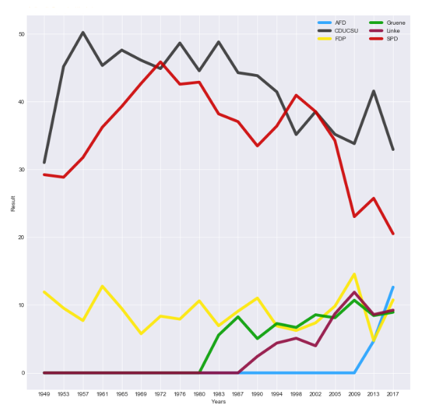

Here you can see that the traditional "Volksparteien" loses more votes over time in general.
This plot also shows that the "Volksparteien" loses uncommonly more votes whenever a new party has been established.

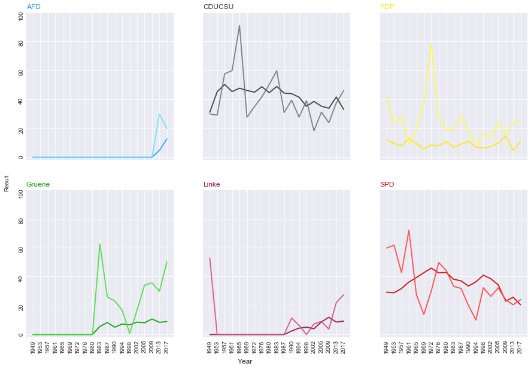

As the previous plot this plots show the election result over time. The brighter graph represents a normalized readability score using inverted Coleman Liau readability. The higher the score, the more readable is the text. Some parties like FDP have a more similar readability over time, while the score is more different for CDU and SPD.
It is hard to see if there is any correlation between the readabilty and the election result. This is also different for each party.

#### 2. Wordclouds
Solarized dark             |  Solarized Ocean
:-------------------------:|:-------------------------:
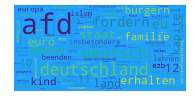  |  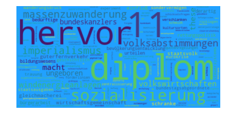
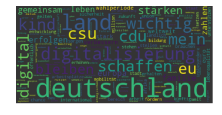  |  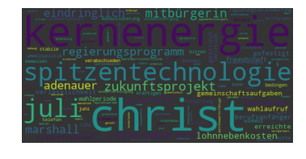
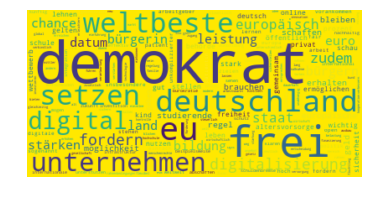  |  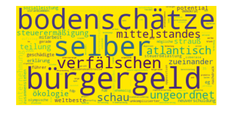
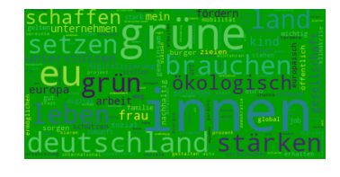  |  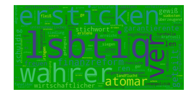
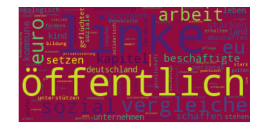  |  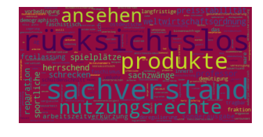
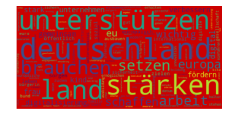  |  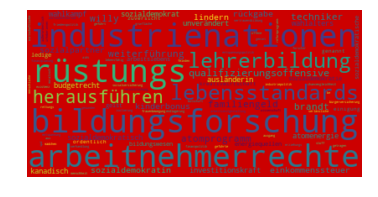

The left column of graphics are just usual word cloud applied on the TF-IDF-score for each word for the federal election year 2017. 
The visualizations on the right are showing a score which is also dependend on the election result for the year 2017 as well. For each term the TF-IDF-value is multiplied by the election result of a party. 
Then the sum for a term over all parties is compted, which is used to normalize the previously computed value. This means, words that are often used by more successfull parties but which are also specific for a choosen party, get the highest scores.
This obviously leads to another selection of words for each party in the world cloud.

##### Sizemap
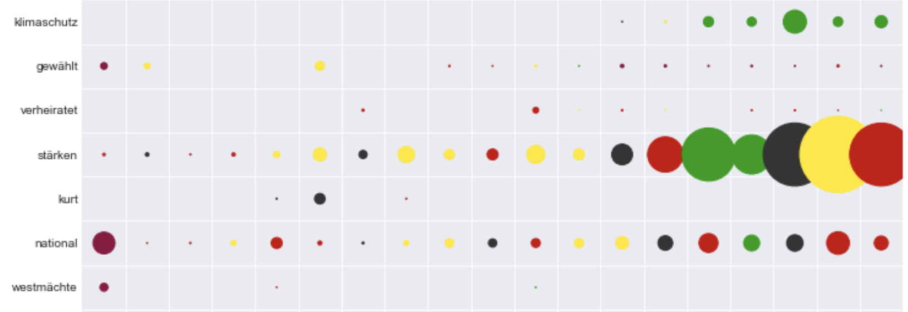

The 'heatmap' shows for each federal election year the sum of the terms from all parties, which is represented by the circle size. The circle color represents the party which has the highest TF-IDF value for this term. For example we can see in this visualization that 'Klimaschutz' is on the political agenda since the last 7 election periods. While it was initially adressed by CDU and FDP it becomes more relevance with 'Die Grünen'.

##### Piemap
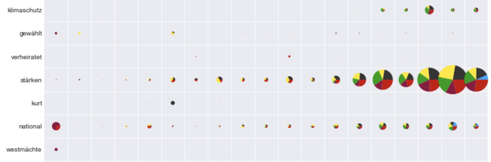

This 'piemap' works similar to the last seen visualisation but instead of showing just the party which has most contributed to the TF-IDF-sum of a specific term, we can see the distributions for the terms as small pie diagrams. The size again represents the overall specificity for the election year. Size is weighted different in this, leading to different sized circles, but the ratios are retained.

##### Document Vector UMAP Reduction
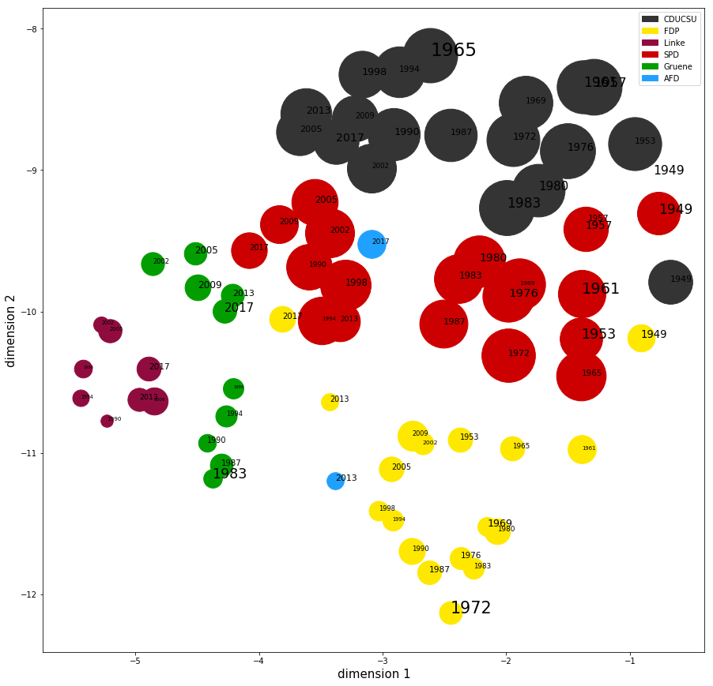

We used TF-IDF-Vectors as document vectors for all federal manifestos, reduced their dimension with UMAP and generated a scotter plot from the results. Color represents a party's color and the election result is mapped to the circle size. The label size containing the election year represents the Coleman Liau readability.
While it is still hard to see if there is a correlation between readability and result we can identify easily the clusters for the parties. Maybe the most interesting thing is the location for AFD at the year 2013 near to the FDP. This is the year in which FDP got less than 5% of the votes.

#### 4. 

## Learnings
We identified two major kinds of visualisations.
The first one consists of visualisations showing differences between two manifestos, years or parties.
The other one shows a broader view over the data.  

When interactivity is introduced into the visualisations which just shows differences between parties, manifestos or years,
it also could transport information in a broader way.

## What's next
In this week we present simple visualisations which communicate only one or few information in a static way.
In the coming week we would like to explore more with interactive visualisations.